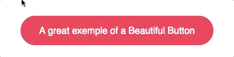

# Css Variables Button

> Recently I saw this [site](https://getgrover.com/de-en/products/iphone-x-64gb) and I found interesting the effect that they applied in the button of purchase, after talking with some people I decided to bring here how it works.



## The Template

#### HTML

```html
<button class="button">
  <span>A great example of a Beautiful Button</span>
</button>
```

## Tracking the position

#### JS
Here we select the element and wait till the user moves his mouse across it, then calculate the position relative to the element and then we save the coordinates in CSS variables

```js
document.querySelector('.button').onmousemove = (e) => {

  const x = e.pageX - e.target.offsetLeft
  const y = e.pageY - e.target.offsetTop

  e.target.style.setProperty('--x', `${ x }px`)
  e.target.style.setProperty('--y', `${ y }px`)
 
}
```

## Animate the gradient

Here the tip is, wrap the text inside a span to avoid that the gradient appears above it, to do that, we use postions absolute and relative.

Start with a width and height of 0px and bring it up to 400px when the user hovers the button. And set a transition to make it appear with a swoosh.

Use the coordinates to follow the mouse

And then apply a radial-gradient to the background and use a closest-side circle. Closest-side fills the whole before without getting beyond it.

#### CSS

```scss
.button {
  position: relative;
  appearance: none;
  background: #f72359;
  padding: 1em 2em;
  border: none;
  color: white;
  font-size: 1.2em;
  cursor: pointer;
  outline: none;
  overflow: hidden;
  border-radius: 100px;
  span {
    position: relative;
  }
  &::before {
    --size: 0;
    content: '';
    position: absolute;
    left: var(--x);
    top: var(--y);
    width: var(--size);
    height: var(--size);
    background: radial-gradient(circle closest-side, #4405f7, transparent);
    transform: translate(-50%, -50%);
    transition: width .2s ease, height .2s ease;
  }
  &:hover::before {
    --size: 400px;
  }
}

```

## Tips
This is a simple way to apply this effect, you can use it for a lot of effects, like a menu, backgrounds etc.
Basically if you will use hover, you can apply this.

You can see the example [HERE](https://jsfiddle.net/leandrocarra/4k5gfktp/1/)
